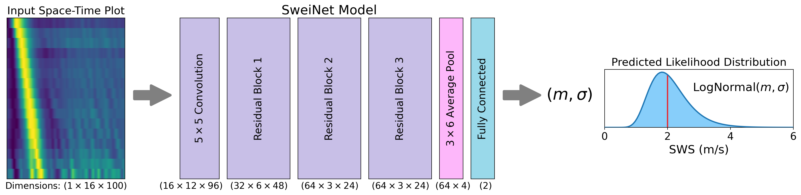
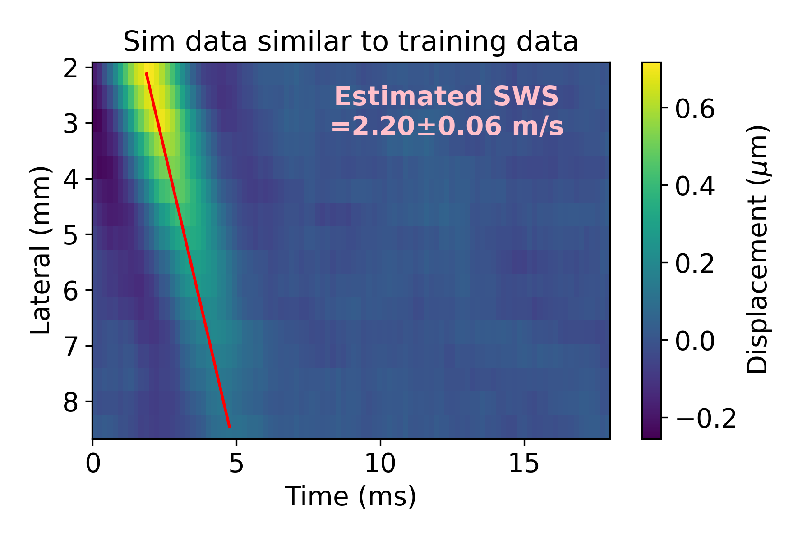
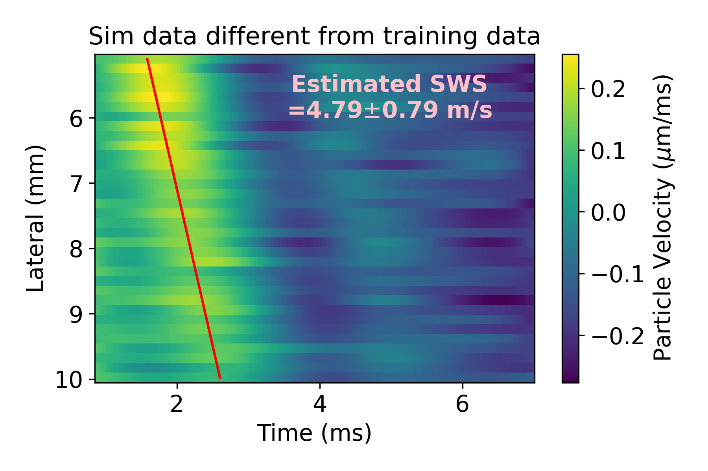

# SweiNet
**SweiNet is an uncertainty-quantifying shear wave speed (SWS) estimator for ultrasound shear wave elasticity (SWE) imaging.**



SweiNet takes as input a 2D space-by-time array of tracked particle motion.
It outputs the estimated SWS and estimated uncertainty, both in units of meters per second.

SweiNet was originally trained on a large dataset of *in vivo* cervix SWE acquisitions.
The predicted uncertainty is well-calibrated to these data.
However, with a few pre-processing steps, SweiNet can be applied to other datasets.

See the example notebook `Example.ipynb` to get started with these two examples:



## Citation
```bibtex
```

## Funding
This work was supported by NIH grants T32GM007171, R01HD072077, R01HD096361.


## Model License
<a rel="license" href="http://creativecommons.org/licenses/by/4.0/"></a><br /><span xmlns:dct="http://purl.org/dc/terms/" href="http://purl.org/dc/dcmitype/Dataset" property="dct:title" rel="dct:type">The trained `SweiNet_weights.pt`</span> for <a xmlns:cc="http://creativecommons.org/ns#" href="https://github.com/fqjin/swei-net/" property="cc:attributionName" rel="cc:attributionURL">SweiNet</a> are licensed under a <a rel="license" href="http://creativecommons.org/licenses/by/4.0/">Creative Commons Attribution 4.0 International License</a>.

## Software License
Copyright 2022 Felix Q. Jin

Licensed under the Apache License, Version 2.0 (the "License");
you may not use this file except in compliance with the License.
You may obtain a copy of the License at

   http://www.apache.org/licenses/LICENSE-2.0

Unless required by applicable law or agreed to in writing, software
distributed under the License is distributed on an "AS IS" BASIS,
WITHOUT WARRANTIES OR CONDITIONS OF ANY KIND, either express or implied.
See the License for the specific language governing permissions and
limitations under the License.
