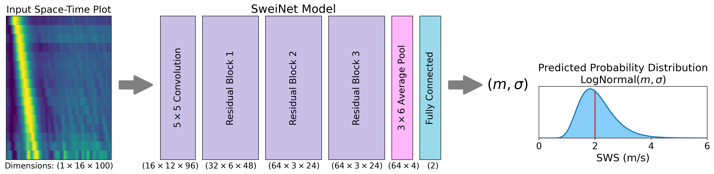

[](https://doi.org/10.5281/zenodo.6374524)
[](https://opensource.org/licenses/Apache-2.0)
# [SweiNet](https://arxiv.org/abs/2203.10678)
**SweiNet is an uncertainty-quantifying shear wave speed (SWS) estimator for ultrasound shear wave elasticity (SWE) imaging.**



SweiNet takes as input a 2D space-by-time array of tracked particle motion.
It outputs the estimated SWS and estimated uncertainty, both in units of meters per second.

SweiNet was originally trained on a large dataset of *in vivo* cervix SWE acquisitions, and the predicted uncertainty is well-calibrated to these data.
With a few pre-processing steps, SweiNet can be applied to other datasets.

Please see the notebook `Example.ipynb` to get started with these two examples:


## Citation
If you find SweiNet useful, please consider citing the following manuscript:
```bibtex
@misc{jin2022sweinet,
      title={SweiNet: Deep Learning Based Uncertainty Quantification for Ultrasound Shear Wave Elasticity Imaging}, 
      author={Felix Q. Jin and Lindsey C. Carlson and Helen Feltovich and Timothy J. Hall and Mark L. Palmeri},
      year={2022},
      eprint={2203.10678},
      archivePrefix={arXiv},
      primaryClass={eess.IV}
}
```

## Funding
This work was supported by NIH grants T32GM007171, R01HD072077, R01HD096361.


## License
Software in this repository is licensed under the [Apache License, Version 2.0](http://www.apache.org/licenses/LICENSE-2.0), as detailed in the LICENSE file.

The trained `SweiNet_weights.pt` is licensed under a <a rel="license" href="http://creativecommons.org/licenses/by/4.0/">Creative Commons Attribution 4.0 International License</a>.

Copyright 2022 Felix Q. Jin